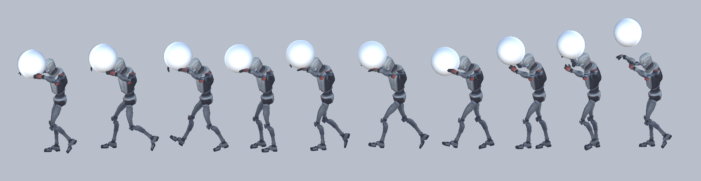
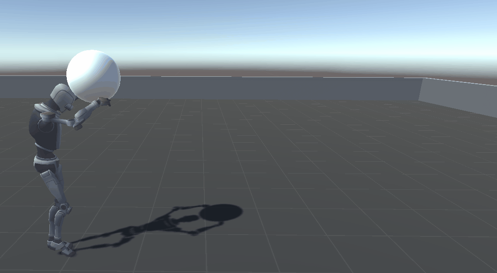

# Object Reactive Animation Generation Using Reinforcement Learning Based on Motion Blending Data   (모션 블렌딩 데이터를 활용한 강화학습 기반 객체 반응형 애니메이션 생성)

### [Paper Link]() / [Journal Link](https://www.earticle.net/Article/A445526)

  
  
  
  

## 개요

###### adove: [ASE: Large-Scale Reusable Adversarial Skill Embeddings for Physically Simulated Characters]
위 그림은 20,000,000 번의 강화학습을 수행한 모습  
2천만번이나 학습했지만 서있는 것 조차 어렵다.

이처럼 물리 기반 시뮬레이션은 학습해야할 양이 너무 많다.  
더 적은 학습량으로 만족할 만한 애니메이션을 생성하는 방법 연구!

## 아이디어
<!--  -->

  

Environment / Observation : 현재 프레임에서 물체의 위치와 회전 각도를 상태 변수로 관찰하여 동작 생성을 위한 정보를 수집한다.

Weight Ratio Function: 각 애니메이션에 무작위 가중치를 할당하고, 전체 가중치의 합으로 나누어 각 애니메이션의 반영 비율을 계산한다.

Motion Blending Module: 애니메이션 가중치를 회전 각도에 적용하여 다음 프레임의 동작을 결정하고, 가중치 조정 및 clamping 보간 함수를 통해 부드럽고 자연스러운 움직임을 생성한다.

Reward System : 에이전트가 생성한 동작이 설정된 목적에 부합하는지 평가하며, 높은 보상을 통해 적합한 동작을 강화한다.

생성된 애니메이션을 환경에서 실행하고, 객체와 상호작용하며 상태 변화를 관찰한 뒤, 보상 정보를 기반으로 새로운 애니메이션 반영 비율을 계산하고 학습한다.

## 실험 환경
Unity Engine  
[unity ml-agents](https://github.com/Unity-Technologies/ml-agents)

### 입력 애니메이션 데이터
mixamo 6 walking animation

  
  
  

  
  
  

## 문제상황 1
### 손으로 물체를 짚는게 자연스럽지 않다.

 
 

### Solve : 사람이 물체를 집을 때처럼 양 손바닥으로 객체를 지지하는 형태에 가까우면 보상을 주도록 설정

## 문제상황 2
### 움직임이 연속적이지 않고 로봇처럼 끊긴다.

 
 

### Solve : 관절이 한순간에 확 비틀어지지 않도록 보간 조정 함수 추가

  
  

