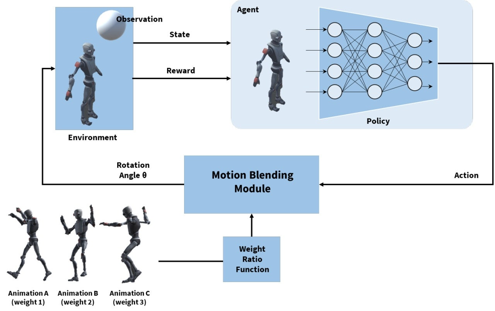
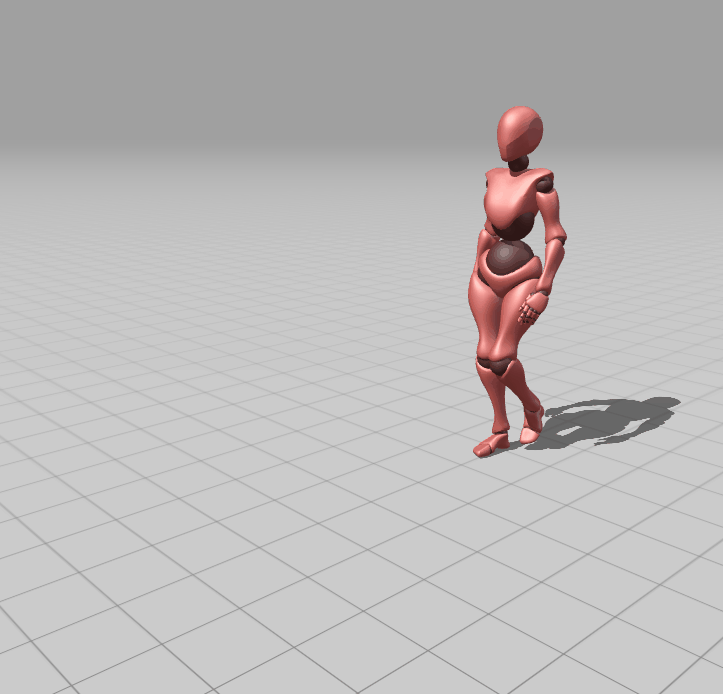

# Object Reactive Animation Generation Using Reinforcement Learning Based on Motion Blending Data   (모션 블렌딩 데이터를 활용한 강화학습 기반 객체 반응형 애니메이션 생성)

### [Paper Link]() / [Journal Link](https://www.earticle.net/Article/A445526)

## 개요

###### adove: [ASE: Large-Scale Reusable Adversarial Skill Embeddings for Physically Simulated Characters]
위 그림은 20,000,000 번의 강화학습을 수행한 모습  
2천만번이나 학습했지만 서있는 것 조차 어렵다.

이처럼 물리 기반 시뮬레이션은 학습해야할 양이 너~무 많다.  
더 적은 학습량으로 만족할 만한 애니메이션을 생성하는 방법 연구!

## 아이디어
<!--  -->

  

### 사용 기술
Unity Engine  
[unity ml-agents](https://github.com/Unity-Technologies/ml-agents)

### input data
from mixamo

6 kind of animation 

  
  
  

  
  
  

### result
